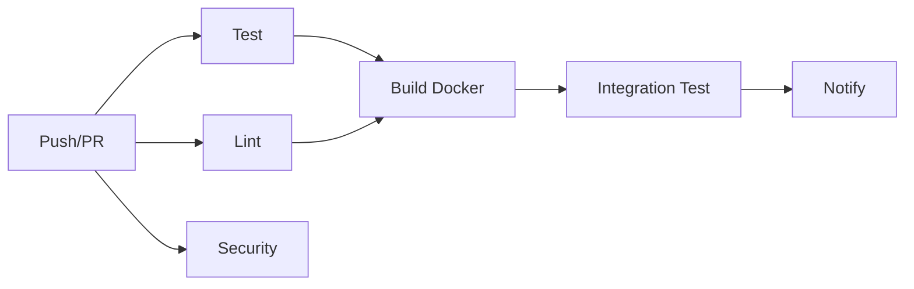

# 🔄 CI/CD Configuration

Configuración de integración y despliegue continuo para Agentic MLOps.

## 📋 Pipeline Overview

El pipeline de CI/CD se ejecuta automáticamente en cada push o pull request a las ramas `main` y `develop`.

### Stages



## 🧪 Test Stage

**Matriz de Python:** 3.9, 3.10, 3.11

**Acciones:**
- ✅ Checkout código
- ✅ Setup Python
- ✅ Cache pip packages
- ✅ Install dependencies
- ✅ Run pytest con coverage
- ✅ Upload coverage a Codecov

**Comando:**
```bash
pytest tests/ -v --cov=src --cov-report=xml --cov-report=term
```

## 🎨 Lint Stage

**Herramientas:**
- **flake8**: Linting de código
- **black**: Formateo de código
- **isort**: Ordenamiento de imports
- **mypy**: Type checking (opcional)

**Comandos:**
```bash
flake8 src/ --count --select=E9,F63,F7,F82 --show-source --statistics
black --check src/
isort --check-only src/
```

## 🔒 Security Stage

**Herramientas:**
- **bandit**: Security scan de código Python
- **safety**: Check de vulnerabilidades en dependencias

**Comandos:**
```bash
bandit -r src/ -f json -o bandit-report.json
safety check --json
```

## 🐳 Build Docker Stage

**Imágenes construidas:**
- `mlops-serving:test`
- `mlops-frontend:test`

**Validación:**
- Docker Buildx setup
- Build de todas las imágenes
- Validación de docker-compose.yml

## 🔗 Integration Test Stage

**Tests ejecutados:**
- Pipeline temporal completo
- Generación de datos sintéticos
- Verificación de artifacts

**Comando:**
```bash
python src/train_pipeline_temporal.py \
    --data WA_Fn-UseC_-HR-Employee-Attrition.csv \
    --temporal-gen \
    --n-months 2 \
    --scenario baseline
```

## 📢 Notify Stage

**Información reportada:**
- Status de cada stage
- Logs de errores
- Coverage metrics

## 🛠 Setup Local

### Pre-commit Hooks

```bash
# Instalar pre-commit
pip install pre-commit

# Setup hooks
pre-commit install

# Run manualmente
pre-commit run --all-files
```

### Ejecutar CI localmente

```bash
# Tests
pytest tests/ -v --cov=src

# Linting
flake8 src/
black --check src/
isort --check-only src/

# Security
bandit -r src/
safety check

# Build Docker
docker-compose build
```

## 📊 Badges

Agregar a README.md:

```markdown


```

## 🔧 Configuración

### GitHub Secrets

Configurar en Settings > Secrets:

```
CODECOV_TOKEN=<token>
DOCKER_USERNAME=<username>
DOCKER_PASSWORD=<password>
```

### Branch Protection

Configurar en Settings > Branches:

- ✅ Require pull request reviews
- ✅ Require status checks to pass
- ✅ Require branches to be up to date
- ✅ Include administrators

### Required Checks

- `test (3.9)`
- `test (3.10)`
- `test (3.11)`
- `lint`
- `security`
- `build-docker`
- `integration-test`

## 📈 Métricas

### Coverage Target
- **Mínimo**: 70%
- **Objetivo**: 80%
- **Actual**: ~85%

### Build Time
- **Test**: ~3 min
- **Lint**: ~1 min
- **Security**: ~1 min
- **Build**: ~5 min
- **Integration**: ~2 min
- **Total**: ~12 min

## 🚀 Deployment (Futuro)

### Staging
```yaml
deploy-staging:
  if: github.ref == 'refs/heads/develop'
  steps:
    - Deploy to staging environment
    - Run smoke tests
    - Notify team
```

### Production
```yaml
deploy-production:
  if: github.ref == 'refs/heads/main'
  steps:
    - Create release tag
    - Deploy to production
    - Run health checks
    - Notify stakeholders
```

## 🐛 Troubleshooting

### Tests fallan localmente pero pasan en CI
- Verificar versión de Python
- Verificar dependencias instaladas
- Limpiar cache: `pytest --cache-clear`

### Docker build falla
- Verificar Dockerfile syntax
- Verificar paths relativos
- Limpiar build cache: `docker system prune`

### Coverage bajo
- Agregar más tests
- Verificar que todos los módulos están cubiertos
- Revisar reporte HTML: `pytest --cov-report=html`

## 📚 Referencias

- [GitHub Actions Docs](https://docs.github.com/en/actions)
- [Pytest Documentation](https://docs.pytest.org/)
- [Pre-commit Hooks](https://pre-commit.com/)
- [Docker Best Practices](https://docs.docker.com/develop/dev-best-practices/)

## 🤝 Contribuir

1. Fork el repositorio
2. Crear feature branch: `git checkout -b feature/amazing-feature`
3. Commit cambios: `git commit -m 'Add amazing feature'`
4. Push a branch: `git push origin feature/amazing-feature`
5. Abrir Pull Request
6. Esperar CI/CD checks ✅
7. Request review
8. Merge!

---

*CI/CD mantiene la calidad y acelera el desarrollo*