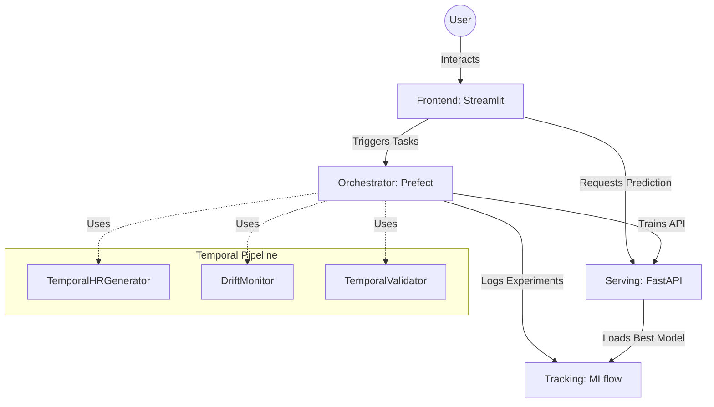

# 🧠 Agentic MLOps: Employee Attrition Prediction with Temporal Validation

 


## 🚀 Project Overview

Sistema MLOps completo para predicción de attrition de empleados con capacidades avanzadas de:
- **Validación Temporal**: Walk-forward validation que respeta el orden cronológico
- **Drift Detection**: Monitoreo robusto con PSI, KS-test y Wasserstein distance
- **Generación Sintética**: Datos temporales con continuidad de cohortes
- **Microservicios**: Arquitectura desacoplada y escalable

---

## 📊 Arquitectura del Sistema

### Evolución: De Monolito a Microservicios



---

## 🎯 Características Principales

### 1. **Pipeline de Entrenamiento Temporal**
```bash
# Entrenamiento con generación temporal
python src/train_pipeline_temporal.py \
    --data WA_Fn-UseC_-HR-Employee-Attrition.csv \
    --temporal-gen \
    --n-months 6 \
    --scenario baseline \
    --temporal-val \
    --n-splits 3
```

**Características:**
- ✅ Generación de datos con continuidad temporal (70% retención)
- ✅ Múltiples escenarios de drift (baseline, recession, tech_boom)
- ✅ Walk-forward validation
- ✅ Drift monitoring con PSI, KS-test, Wasserstein
- ✅ MLflow tracking integrado

### 2. **Detección Avanzada de Drift**

**Métricas Implementadas:**
- **PSI (Population Stability Index)**: Estándar en banca/RRHH
- **KS-Test**: Cambios en distribuciones
- **Wasserstein Distance**: Distancia entre distribuciones
- **Concept Drift**: Cambios en P(Y|X)

**Umbrales de Alerta:**
- 0-5 alertas: NORMAL
- 6-15 alertas: WARNING
- 16+ alertas: CRITICAL (reentrenar)

### 3. **Validación Temporal**

**Walk-Forward Validation:**
```python
# Expanding window: entrena con datos históricos crecientes
# Rolling window: ventana deslizante de tamaño fijo
validator = TemporalValidator(strategy='expanding', n_splits=4)
results = validator.validate(pipeline, X, y)
```

**Ventajas:**
- ✅ Evita data leakage
- ✅ Simula producción real
- ✅ Detecta performance decay
- ✅ Valida robustez temporal

---

## 🛠 Componentes del Sistema

### Core ML Pipeline
| Componente | Descripción | Líneas |
|------------|-------------|--------|
| `train_pipeline.py` | Pipeline original de entrenamiento | 181 |
| `train_pipeline_temporal.py` | Pipeline con validación temporal | 465 |
| `temporal_generator.py` | Generador con continuidad temporal | 476 |
| `drift_monitor.py` | Sistema robusto de drift detection | 476 |
| `temporal_validation.py` | Walk-forward validation | 390 |

### Microservicios
| Servicio | Puerto | Descripción |
|----------|--------|-------------|
| Frontend | 8501 | Streamlit UI |
| Orchestrator | 4200 | Prefect workflows |
| Tracking | 5000 | MLflow experiments |
| Serving API | 8000 | FastAPI predictions |

### Experimentos y Ejemplos
| Directorio | Contenido |
|------------|-----------|
| `experiments/` | Comparación de generadores |
| `examples/` | Scripts de uso del pipeline temporal |
| `docs/` | Documentación técnica completa |

---

## ⚡ Quick Start

### Opción 1: Microservicios Completos
```bash
# Levantar toda la infraestructura
podman-compose up --build

# Acceder a los servicios
# Frontend: http://localhost:8501
# Prefect: http://localhost:4200
# MLflow: http://localhost:5000
# API: http://localhost:8000/docs
```

### Opción 2: Pipeline Temporal Standalone
```powershell
# Windows (Podman)
powershell -ExecutionPolicy Bypass -File examples\run_temporal_pipeline.ps1 -Mode temporal -Months 6

# Linux/Mac
bash examples/train_with_temporal.sh
```

### Opción 3: Python Directo
```bash
# Entrenamiento básico
python src/train_pipeline.py --data WA_Fn-UseC_-HR-Employee-Attrition.csv

# Con validación temporal
python src/train_pipeline_temporal.py \
    --data WA_Fn-UseC_-HR-Employee-Attrition.csv \
    --temporal-gen \
    --n-months 12 \
    --scenario economic_recession \
    --temporal-val \
    --n-splits 4
```

---

## 📈 Resultados y Métricas

### Performance del Modelo
```json
{
  "roc_auc": 0.6853,
  "f1_score": 0.54,
  "precision": 0.68,
  "recall": 0.46
}
```

### Comparación de Generadores
| Métrica | Original | Temporal | Ganador |
|---------|----------|----------|---------|
| ROC-AUC (Temporal Val) | 0.6206 | **0.6673** | ✅ Temporal |
| Data Leakage | 0.0216 | 0.0218 | ✅ Original |
| Continuidad Empleados | 0% | **58.71%** | ✅ Temporal |
| Alertas Drift | 2 | **23** | ✅ Temporal |

**Conclusión:** El generador temporal gana en realismo y robustez (4 vs 3 puntos).

---

## 🎓 Escenarios de Drift Disponibles

### 1. `baseline`
- Condiciones normales de negocio
- Attrition estable (~16%)
- Sin cambios significativos

### 2. `economic_recession`
- Recesión económica
- Aumentos salariales bajos
- Mayor estrés por distancia
- Attrition aumenta gradualmente

### 3. `tech_boom`
- Boom tecnológico
- Aumentos salariales altos
- Mayor competencia por talento
- Attrition alta en roles técnicos

### 4. `high_competition`
- Alta competencia en el mercado
- Rotación acelerada
- Cambios en satisfacción laboral

---

## 📚 Documentación

### Guías Principales
- **[Análisis Crítico](docs/propuesta_analisis_critico.md)**: Evaluación técnica de la propuesta
- **[Implementation Guide](docs/IMPLEMENTATION_GUIDE.md)**: Guía completa de implementación
- **[Quick Start](docs/QUICK_START.md)**: Inicio rápido
- **[Examples README](examples/README.md)**: Ejemplos de uso del pipeline temporal

### Experimentos
- **[Comparison Results](experiments/comparison_results.json)**: Resultados de comparación
- **[Experiments README](experiments/README.md)**: Documentación de experimentos

---

## 🔧 Decisiones de Diseño

### 1. **Prefect over Airflow**
- Menor overhead operacional
- Code-as-data approach
- Retry mechanisms robustos

### 2. **MLflow con SQLite**
- Simplifica deployment inicial
- Full UI experience
- Roadmap: Migración a PostgreSQL

### 3. **FastAPI para Serving**
- REST API estándar
- Documentación automática (Swagger)
- Alto performance

### 4. **Podman/Docker Compose**
- "Works on my machine" → "Works everywhere"
- Aislamiento de dependencias
- Fácil escalabilidad

### 5. **Validación Temporal**
- Evita data leakage
- Simula producción real
- Detecta performance decay

---

## 🔐 Seguridad y Roadmap

### Implementado ✅
- ✅ Validación de rutas (path traversal protection)
- ✅ Versionado de modelos
- ✅ Data governance
- ✅ Drift monitoring
- ✅ Containerización

### Roadmap 🚧
- 🚧 Authentication (OAuth2/OIDC)
- 🚧 Dynamic Scaling (Kubernetes)
- 🚧 Automated Retraining (Drift triggers)
- 🚧 A/B Testing framework
- 🚧 Model explainability (SHAP)

---

## 🧪 Testing

### Tests Unitarios (Pendiente)
```bash
pytest tests/ -v --cov=src
```

### Validación Manual
```bash
# Test de inferencia
python test_inference.py

# Test del API
curl -X POST http://localhost:8000/predict \
  -H "Content-Type: application/json" \
  -d @test_request.json
```

---

## 📊 Estructura del Proyecto

```
agentic_mlops/
├── src/                          # Código fuente
│   ├── train_pipeline.py         # Pipeline original
│   ├── train_pipeline_temporal.py # Pipeline temporal
│   ├── temporal_generator.py     # Generador temporal
│   ├── drift_monitor.py          # Drift detection
│   ├── temporal_validation.py    # Walk-forward validation
│   └── utils.py                  # Utilidades
├── services/                     # Microservicios
│   ├── frontend/                 # Streamlit UI
│   ├── orchestrator/             # Prefect
│   ├── serving/                  # FastAPI
│   └── tracking/                 # MLflow
├── experiments/                  # Experimentos
│   ├── compare_generators.py     # Comparación
│   └── comparison_results.json   # Resultados
├── examples/                     # Ejemplos de uso
│   ├── run_temporal_pipeline.ps1 # Script Windows
│   └── README.md                 # Documentación
├── docs/                         # Documentación
│   ├── propuesta_analisis_critico.md
│   ├── IMPLEMENTATION_GUIDE.md
│   └── QUICK_START.md
├── data/                         # Datasets
├── models/                       # Modelos entrenados
└── docker-compose.yml            # Orquestación
```

---

## 💡 Casos de Uso

### 1. Testing de Robustez
```bash
# Validar que el modelo funciona bien con datos futuros
python src/train_pipeline_temporal.py \
    --data WA_Fn-UseC_-HR-Employee-Attrition.csv \
    --temporal-gen --n-months 12 \
    --scenario baseline --temporal-val --n-splits 4
```

### 2. Simulación de Crisis
```bash
# Evaluar performance bajo condiciones adversas
python src/train_pipeline_temporal.py \
    --data WA_Fn-UseC_-HR-Employee-Attrition.csv \
    --temporal-gen --n-months 12 \
    --scenario economic_recession \
    --temporal-val --n-splits 4
```

### 3. Desarrollo sin Datos Reales
```bash
# Desarrollar features sin acceso a producción
python src/train_pipeline_temporal.py \
    --data WA_Fn-UseC_-HR-Employee-Attrition.csv \
    --temporal-gen --n-months 6 --scenario baseline
```

---


---

## 🤝 Contribuciones

Este proyecto demuestra:
- ✅ Arquitectura de microservicios
- ✅ MLOps best practices
- ✅ Validación temporal robusta
- ✅ Drift detection avanzado
- ✅ Data governance
- ✅ Containerización
- ✅ Documentación completa

---

## 📞 Contacto

**Franco Yair Benko**
- LinkedIn: [Franco Benko](https://linkedin.com/in/franco-benko)
- Email: franco.benko@ibm.com

---

