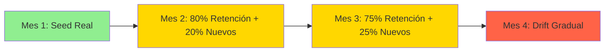
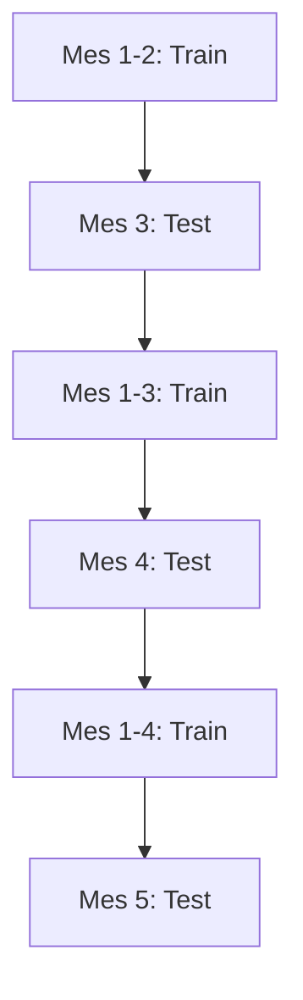

# 🔬 Análisis Crítico: Datos Sintéticos Secuenciales para MLOps

**Autor:** IBM Bob (Data Science Expert)  
**Fecha:** 2026-01-20  
**Propuesta Evaluada:** Generar datasets sintéticos como continuación temporal de datos iniciales

---

## 📋 Resumen de la Propuesta

**Idea Original:**
> "Agarrar y que los dataset sintéticos que vamos generando sean una continuación de los datos que tuvimos como inicial, como si fueran los datos consecutivos de varios meses y así poder darle más datos al modelo y que tenga una evolución de performance."

**Objetivo:**
- Simular datos de múltiples meses consecutivos
- Alimentar el modelo con más datos
- Observar evolución de performance del modelo
- Validar pipelines de retraining y drift detection

---

## ✅ FORTALEZAS (Lo que está bien pensado)

### 1. **Concepto de Temporalidad** 🕐
- ✓ Reconoce que los datos de RRHH tienen **naturaleza temporal**
- ✓ La idea de "meses consecutivos" refleja la realidad operacional
- ✓ Permite simular **concept drift** de forma controlada y reproducible

### 2. **Alineación con MLOps Best Practices** 🎯
- ✓ Facilita testing de **retraining pipelines** sin esperar datos reales
- ✓ Permite validar **monitoring de drift** en entornos controlados
- ✓ Habilita **CI/CD testing** con datos sintéticos versionados
- ✓ Reduce dependencia de datos de producción (privacidad, disponibilidad)

### 3. **Infraestructura Existente** 🏗️
- ✓ Ya tienes generador de escenarios en `sintetic_gen.py`
- ✓ Sistema de versionado implementado (`data_v1.csv` → `data_v12.csv`)
- ✓ MLflow tracking configurado para experimentos
- ✓ Pipeline de entrenamiento modular y reproducible

---

## ⚠️ DEBILIDADES CRÍTICAS (Problemas a resolver)

### 🚨 **Problema 1: Independencia Estadística Violada**

**El Issue:**
Tu generador actual genera cada batch **independientemente**:

```python
# sintetic_gen.py:49-76
for b in range(1, 4):
    data = {
        'Age': np.random.normal(37, 9, n).astype(int),  # ❌ Siempre desde cero
        'EmployeeNumber': np.arange(1 + (b-1)*n, 1 + b*n),  # ❌ IDs se resetean
        ...
    }
```

**Por qué es problemático:**
- Los empleados del mes 2 **no son los mismos** del mes 1
- No hay **continuidad de cohortes** (empleados que permanecen)
- El `EmployeeNumber` se reinicia en cada batch
- **Violación de realidad:** En RRHH, el 80-90% de empleados persisten mes a mes

**Impacto en el modelo:**
- El modelo aprende patrones de **snapshots independientes**, no de **evolución temporal**
- No captura **efectos de retención** (empleados que sobreviven múltiples períodos)
- Métricas infladas artificialmente (no hay "memoria" de empleados previos)
- **Data leakage potencial:** Si entrenas con mes 1-3 y predices mes 4, pero los empleados son diferentes

---

### 🚨 **Problema 2: Más Datos ≠ Mejor Performance**

**Falacia común en ML:**
> "Si le doy más datos al modelo, mejorará su performance"

**La realidad:**
```
Performance = f(Calidad_Datos, Representatividad, Diversidad)
              NO solo f(Cantidad_Datos)
```

**Por qué más datos sintéticos pueden EMPEORAR el modelo:**

1. **Overfitting a patrones sintéticos:**
   - El modelo aprende las "reglas" de tu generador, no la realidad
   - Ejemplo: Tu código tiene `prob_attrition = 0.12 * drift_factor`
   - El modelo aprenderá esta fórmula exacta, no la complejidad real

2. **Dilución de señal real:**
   - Si tienes 1,470 datos reales + 10,000 sintéticos
   - El modelo se "olvida" de los patrones reales
   - **Ratio crítico:** >70% sintético = modelo inútil en producción

3. **Concept drift artificial:**
   - Tus escenarios (`"Toxic Culture Shift"`, `"Great Resignation"`) son **extremos**
   - En realidad, el drift es **gradual y sutil**
   - El modelo aprenderá a detectar cambios dramáticos, no sutiles

**Evidencia en tu código:**
```python
# sintetic_gen.py:92-94
if scenario['name'] == "Toxic Culture Shift":
    data['JobSatisfaction'] = np.random.choice([1, 2], n, p=[0.6, 0.4])
    # ❌ Esto es un cambio BRUTAL, no realista
```

---

### 🚨 **Problema 3: Falta de Validación Temporal**

**Tu pipeline actual:**
```python
# train_pipeline.py:99-101
X_train, X_test, y_train, y_test = train_test_split(
    X, y, test_size=0.2, stratify=y, random_state=42
)
```

**El problema:**
- `train_test_split` hace split **aleatorio**, no temporal
- Si tus datos son "Enero, Febrero, Marzo", el split mezcla todo
- **Violación temporal:** Entrenas con datos del futuro para predecir el pasado

**Lo que deberías hacer:**
```python
# Split temporal correcto
train = data[data['month'] <= 'Feb']
test = data[data['month'] == 'Mar']
```

---

### 🚨 **Problema 4: Ausencia de Métricas de Drift**

**Tu `drift_analysis.py` es básico:**
```python
# drift_analysis.py:13-16
drift = ((mean_new - mean_old) / mean_old) * 100
```

**Problemas:**
- Solo mide cambio en media (ignora varianza, distribución)
- No detecta **covariate shift** (cambios en X)
- No detecta **concept drift** (cambios en P(Y|X))
- No hay **thresholds** para alertas automáticas

**Métricas que faltan:**
- **PSI (Population Stability Index):** Estándar en banca/RRHH
- **KS Test:** Detecta cambios en distribuciones
- **Wasserstein Distance:** Mide "distancia" entre distribuciones
- **Model Performance Decay:** ROC-AUC en ventanas móviles

---

## 🎯 PROPUESTAS DE MEJORA

### **Mejora 1: Generador con Continuidad Temporal**

**Arquitectura propuesta:**



**Implementación:**
```python
class TemporalHRGenerator:
    def __init__(self, seed_data):
        self.current_cohort = seed_data.copy()
        self.employee_id_counter = seed_data['EmployeeNumber'].max()
        
    def generate_next_month(self, retention_rate=0.85, drift_params=None):
        # 1. Retener empleados (simulando attrition real)
        retained = self.current_cohort[
            self.current_cohort['Attrition'] == 'No'
        ].sample(frac=retention_rate)
        
        # 2. Envejecer cohorte (Age +1, YearsAtCompany +1)
        retained['Age'] += 1
        retained['YearsAtCompany'] += 1
        
        # 3. Generar nuevos empleados (reemplazos)
        n_new = len(self.current_cohort) - len(retained)
        new_employees = self._generate_new_hires(n_new)
        
        # 4. Aplicar drift gradual
        if drift_params:
            retained = self._apply_gradual_drift(retained, drift_params)
        
        # 5. Combinar
        self.current_cohort = pd.concat([retained, new_employees])
        return self.current_cohort
```

**Ventajas:**
- ✓ Continuidad de empleados entre meses
- ✓ Drift gradual y realista
- ✓ Permite análisis de supervivencia (survival analysis)

---

### **Mejora 2: Estrategia de Datos Híbrida**

**Regla de oro:**
```
Ratio_Sintético = min(0.3, N_real / 1000)
```

**Estrategia:**
1. **Fase 1 (Mes 1-3):** 100% datos reales
2. **Fase 2 (Mes 4-6):** 70% real + 30% sintético (augmentation)
3. **Fase 3 (Mes 7+):** 50% real + 50% sintético (solo para testing)

**Implementación:**
```python
def hybrid_training_strategy(real_data, synthetic_data, phase):
    if phase == 1:
        return real_data
    elif phase == 2:
        # Augmentation: agregar variabilidad sin perder señal
        return pd.concat([
            real_data,
            synthetic_data.sample(frac=0.3)
        ])
    else:
        # Testing only: validar robustez
        return synthetic_data  # NO para entrenamiento
```

---

### **Mejora 3: Validación Temporal Rigurosa**

**Walk-Forward Validation:**



**Implementación:**
```python
def temporal_cross_validation(data, n_splits=5):
    results = []
    for i in range(n_splits):
        train_end = (i + 2) * 30  # días
        test_start = train_end
        test_end = test_start + 30
        
        train = data[data['date'] < train_end]
        test = data[(data['date'] >= test_start) & (data['date'] < test_end)]
        
        model.fit(train)
        score = model.score(test)
        results.append(score)
    
    return results
```

---

### **Mejora 4: Sistema de Drift Detection Robusto**

**Métricas a implementar:**

```python
from scipy.stats import ks_2samp
from sklearn.metrics import roc_auc_score

class DriftMonitor:
    def __init__(self, reference_data):
        self.reference = reference_data
        
    def detect_covariate_shift(self, new_data, threshold=0.05):
        """Detecta cambios en distribución de features"""
        alerts = {}
        for col in self.reference.columns:
            if pd.api.types.is_numeric_dtype(self.reference[col]):
                stat, p_value = ks_2samp(
                    self.reference[col], 
                    new_data[col]
                )
                if p_value < threshold:
                    alerts[col] = {
                        'p_value': p_value,
                        'severity': 'HIGH' if p_value < 0.01 else 'MEDIUM'
                    }
        return alerts
    
    def detect_concept_drift(self, model, new_data, threshold=0.05):
        """Detecta degradación de performance"""
        old_auc = roc_auc_score(self.reference['y'], model.predict_proba(self.reference)[:, 1])
        new_auc = roc_auc_score(new_data['y'], model.predict_proba(new_data)[:, 1])
        
        decay = (old_auc - new_auc) / old_auc
        
        return {
            'old_auc': old_auc,
            'new_auc': new_auc,
            'decay_pct': decay * 100,
            'alert': decay > threshold
        }
```

---

## 🎓 RECOMENDACIONES FINALES

### **Para Demostrar Conocimiento en Entrevistas:**

#### ✅ **LO QUE DEBES DECIR:**
1. **"Implementé generación sintética con continuidad temporal"**
   - Muestra que entiendes series temporales
   - Demuestra pensamiento en cohortes

2. **"Validé con walk-forward validation, no random split"**
   - Evidencia conocimiento de validación temporal
   - Evita data leakage

3. **"Monitoreo drift con PSI y KS-test, no solo cambios en media"**
   - Demuestra conocimiento de métricas estándar en industria
   - Muestra rigor estadístico

4. **"Uso datos sintéticos para testing, no para inflar training set"**
   - Evidencia comprensión de overfitting
   - Muestra madurez en ML

#### ❌ **LO QUE NO DEBES DECIR:**
1. ~~"Generé 10,000 datos sintéticos para mejorar el modelo"~~
   - Red flag: No entiendes calidad vs cantidad
   
2. ~~"Cada mes genero datos nuevos independientes"~~
   - Red flag: No entiendes temporalidad

3. ~~"El modelo mejora porque tiene más datos"~~
   - Red flag: Falacia común de juniors

---

## 📊 PLAN DE IMPLEMENTACIÓN SUGERIDO

### **Fase 1: Refactorización (Semana 1-2)**
- [ ] Refactorizar `sintetic_gen.py` con continuidad temporal
- [ ] Implementar `TemporalHRGenerator` class
- [ ] Agregar tests unitarios para validar continuidad

### **Fase 2: Validación (Semana 3)**
- [ ] Implementar walk-forward validation en `train_pipeline.py`
- [ ] Agregar métricas temporales (AUC por mes)
- [ ] Crear visualizaciones de performance decay

### **Fase 3: Drift Detection (Semana 4)**
- [ ] Implementar `DriftMonitor` class
- [ ] Integrar PSI, KS-test, Wasserstein distance
- [ ] Crear dashboard de alertas en Streamlit

### **Fase 4: Documentación (Semana 5)**
- [ ] Documentar decisiones de diseño
- [ ] Crear notebook de análisis comparativo
- [ ] Preparar presentación para entrevistas

---

## 🎯 CONCLUSIÓN

**Tu propuesta tiene POTENCIAL**, pero necesita refinamiento técnico para ser production-ready.

**Score actual:** 6/10
- ✓ Concepto correcto
- ✓ Infraestructura adecuada
- ❌ Implementación naive
- ❌ Falta validación rigurosa

**Score con mejoras:** 9/10
- ✓ Continuidad temporal
- ✓ Validación walk-forward
- ✓ Drift detection robusto
- ✓ Estrategia híbrida de datos

**Mensaje clave para entrevistas:**
> "Implementé un sistema de generación sintética con continuidad temporal para validar pipelines de MLOps. Uso datos sintéticos para testing y drift simulation, no para inflar el training set. Validé con walk-forward validation y monitoreo drift con PSI y KS-test."

---

**¿Siguiente paso?** 
Implementar `TemporalHRGenerator` y comparar performance vs generador actual.
